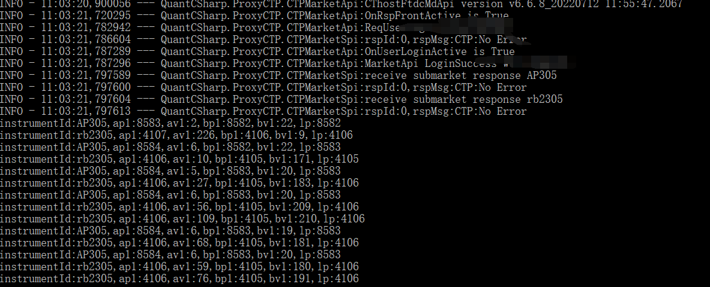
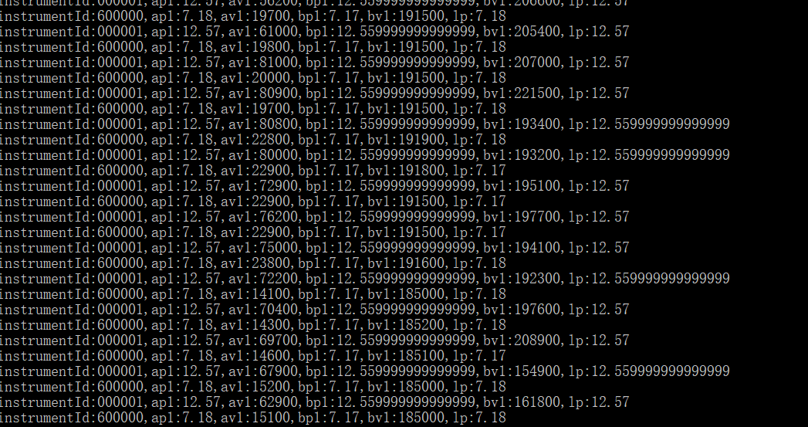

# quantcsharp
ctp、xtp wrapper, 100% csharp for MdApi and TraderApi,  stock, future

柜台api大部分是以`C++`为主，但是`C++`开发应用比较笨拙。网上几个开放的python封装、java封装的api，试用了部分，比较凌乱和粗糙。
在业余时间通过`C#`函数指针的形式，100%封装了ctp、xtp接口以支持期货与股票类型的行情与交易，不仅支持windows环境，同样在centos、ubuntu平台可以流畅运行。
使用`C#`开发业务应用系统以及做数据处理和研究，生产力相较`C++`提升了何止10倍。在windows环境下做策略研究以及执行交易调试，最终发布到unix环境上线，流程完全打通。

# RELEASE
- ctp_market_win(1.0.1)
- ctp_market_unix(1.0.1)
- xtp_market_win(1.0.1)
- xtp_market_unix(1.0.1)

# CTP(v6.6.8)
一个行情例子：
```csharp
class CtpMarketSubs : IWorkHandler<CThostFtdcDepthMarketDataField>
{
    public CtpMarketSubs() {
        IQuotesProxy cTPMarket = new CTPMarketSpi(this,System.IO.Path.Combine(AppContext.BaseDirectory, "configs", "ctpconfig.ini"));
        cTPMarket.Load();
        cTPMarket.TraceQuotes("AP305","rb2305");
    }

    void IWorkHandler<CThostFtdcDepthMarketDataField>.OnEvent(CThostFtdcDepthMarketDataField evt)
    {
        Console.WriteLine($"instrumentId:{evt.InstrumentID.ToPtrString()},ap1:{evt.AskPrice1},av1:{evt.AskVolume1},bp1:{evt.BidPrice1},bv1:{evt.BidVolume1},lp:{evt.LastPrice}");
    }
}
```
可以看到输出日志,输出实时行情   



# XTP(v2.2.27)
一个行情例子：
```csharp
class XtpMarketSubs : IWorkHandler<XTPMarketDataStruct>
{
    public XtpMarketSubs() {
        IQuotesProxy cTPMarket = new XTPMarketSpi(this,System.IO.Path.Combine(AppContext.BaseDirectory, "configs", "xtpconfig.ini"));
        cTPMarket.Load();
        cTPMarket.TraceQuotes("000001.SZ","600000.SH");
    }

    void IWorkHandler<XTPMarketDataStruct>.OnEvent(XTPMarketDataStruct evt)
    {
        Console.WriteLine($"instrumentId:{evt.Ticker.ToPtrString()},ap1:{evt.Ask[0]},av1:{evt.AskQty[0]},bp1:{evt.Bid[0]},bv1:{evt.BidQty[0]},lp:{evt.LastPrice}");
    }
}
```
可以看到输出日志,输出实时行情   


__NOTE:__ 
发布到unix环境上时,注意增加一个软链接到so文件,比如 
ln -s thosttraderapi thosttraderapi.so   
ln -s xtpquoteapi  libxtpquoteapi.so


__NOTE:__ 
代码是从项目中抽取部分接口释放出来的, 在win/centos上执行均没有问题, 交易接口暂时没有release计划, 请知.
近期工作氛围发生一些变化, 技术交流或有内推机会请联系 qq群: __37385904__, 多谢合作！！

